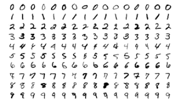
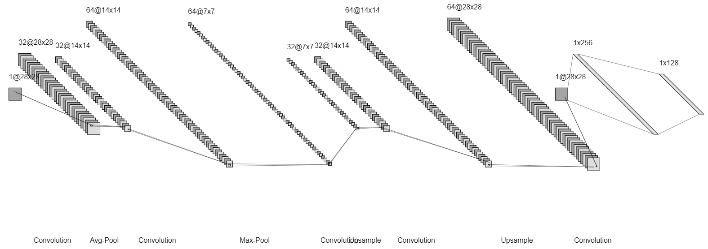
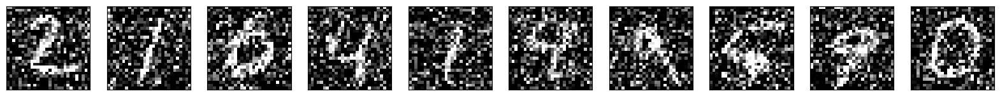
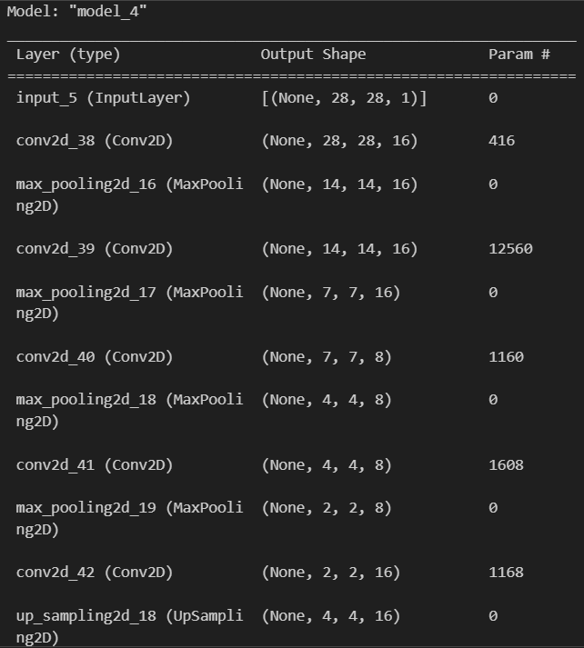
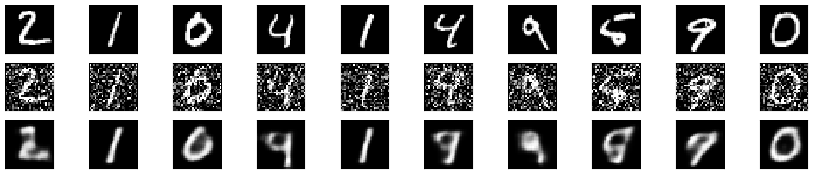

## CONVOLUTIONAL AUTOENCODER FOR IMAGE DENOISING...

### AIM:

To develop a convolutional autoencoder for image denoising application.

### PROBLEM STATEMENT:

Image Denoising is the process of removing noise from the Images. The noise present in the images may be caused by various intrinsic or extrinsic conditions which are practically hard to deal with. 

Modeling image data requires a special approach in the neural network world. The best-known neural network for modeling image data is the Convolutional Neural Network (CNN).

The CNN design can be used for image recognition/classification, or be used for image noise reduction or coloring. 

This program demonstrates how to implement a deep convolutional autoencoder for image denoising, mapping noisy digits images from the MNIST dataset to clean digits images.

### DATASET:



### CONVOLUTIONAL AUTOENCODER NEURAL NETWORK MODEL:




### DESIGN STEPS:

#### STEP 1:

Import the necessary libraries and download the mnist dataset.

#### STEP 2:

Load the dataset and scale the values for easier computation.

#### STEP 3:

Add noise to the images randomly for the process of denoising it with the convolutional denoising autoencoders for both the training and testing sets.

#### STEP 4:

Build the Neural Model for convolutional denoising autoencoders using Convolutional, Pooling and Up Sampling layers. Make sure the input shape and output shape of the model are identical.

#### STEP 5:

Pass test data for validating manually. Compile and fit the created model.

#### STEP 6:

Plot the Original, Noisy and Reconstructed Image predictions for visualization.

#### STEP 7:

End the program.

### PROGRAM:

```python
## Developed : Kavinraja D
## Reg : 212222240047
Program to develop a convolutional autoencoder for image denoising application.

from tensorflow import keras
from tensorflow.keras import layers
from tensorflow.keras import utils
from tensorflow.keras import models
from tensorflow.keras.datasets import mnist
import numpy as np
import matplotlib.pyplot as plt

(x_train, _), (x_test, _) = mnist.load_data()

x_train.shape

x_train_scaled = x_train.astype('float32') / 255.
x_test_scaled = x_test.astype('float32') / 255.
x_train_scaled = np.reshape(x_train_scaled, (len(x_train_scaled), 28, 28, 1))
x_test_scaled = np.reshape(x_test_scaled, (len(x_test_scaled), 28, 28, 1))

noise_factor = 0.8
x_train_noisy = x_train_scaled + noise_factor * np.random.normal(loc=0.0, scale=1.0, size=x_train_scaled.shape) 
x_test_noisy = x_test_scaled + noise_factor * np.random.normal(loc=0.0, scale=1.0, size=x_test_scaled.shape) 
x_train_noisy = np.clip(x_train_noisy, 0., 1.)
x_test_noisy = np.clip(x_test_noisy, 0., 1.)

n = 10
plt.figure(figsize=(20, 2))
for i in range(1, n + 1):
    ax = plt.subplot(1, n, i)
    plt.imshow(x_test_noisy[i].reshape(28, 28))
    plt.gray()
    ax.get_xaxis().set_visible(False)
    ax.get_yaxis().set_visible(False)
plt.show()

input_img = keras.Input(shape=(28, 28, 1))

input_img = keras.Input(shape=(28, 28, 1))

# Write your encoder here

a = layers.Conv2D(16,(5,5),activation='relu',padding='same')(input_img)

a= layers.MaxPooling2D((2,2),padding='same')(a)

a = layers.Conv2D(16,(7,7),activation='relu',padding='same')(a)

a= layers.MaxPooling2D((2,2),padding='same')(a)

a = layers.Conv2D(8,(3,3),activation='relu',padding='same')(a)

a = layers.MaxPooling2D((2, 2), padding='same')(a)

a = layers.Conv2D(8,(5,5),activation='relu',padding='same')(a)

encoded = layers.MaxPooling2D((2, 2), padding='same')(a)

a=layers.Conv2D(16,(3,3),activation='relu',padding='same')(encoded)

a=layers.UpSampling2D((2,2))(a)

a=layers.Conv2D(8,(7,7),activation='relu',padding='same')(a)

a=layers.UpSampling2D((2,2))(a)

a=layers.Conv2D(16,(3,3),activation='relu',padding='same')(a)

a=layers.UpSampling2D((2,2))(a)

a=layers.Conv2D(8,(5,5),activation='relu',padding='same')(a)

a=layers.UpSampling2D((2,2))(a)

a=layers.Conv2D(8,(5,5),activation='relu')(a)

decoded = layers.Conv2D(1, (3, 3), activation='sigmoid', padding='same')(a)

autoencoder = keras.Model(input_img, decoded)

autoencoder.summary()

autoencoder.compile(optimizer='adam', loss='binary_crossentropy')

autoencoder.fit(x_train_noisy, x_train_scaled,
                epochs=3,
                batch_size=128,
                shuffle=True,
                validation_data=(x_test_noisy, x_test_scaled))
                
decoded_imgs = autoencoder.predict(x_test_noisy)

n = 10
plt.figure(figsize=(20, 4))
for i in range(1, n + 1):
    # Display original:
    ax = plt.subplot(3, n, i)
    plt.imshow(x_test_scaled[i].reshape(28, 28))
    plt.gray()
    ax.get_xaxis().set_visible(False)
    ax.get_yaxis().set_visible(False)

    # Display noisy:
    ax = plt.subplot(3, n, i+n)
    plt.imshow(x_test_noisy[i].reshape(28, 28))
    plt.gray()
    ax.get_xaxis().set_visible(False)
    ax.get_yaxis().set_visible(False)    

    # Display reconstruction:
    ax = plt.subplot(3, n, i + 2*n)
    plt.imshow(decoded_imgs[i].reshape(28, 28))
    plt.gray()
    ax.get_xaxis().set_visible(False)
    ax.get_yaxis().set_visible(False)
    
plt.show()

```

# OUTPUT:

### ADDING NOISE TO THE MNIST DATASET:



### AUTOENCODER.SUMMARY():



### ORIGINAL V/S NOISY V/S RECONSTRUCTED IMAGE:




### RESULT:

Thus, the program to develop a convolutional autoencoder for image denoising application is developed and executted successfully.
